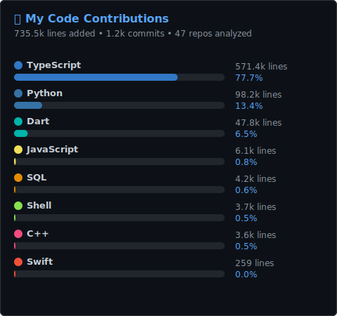

<div align="center">

<!-- HEADER -->


<!-- TYPING -->
<a href="https://git.io/typing-svg">
  
</a>

<br/>

[](https://github.com/icetrahan)
[](https://github.com/icetrahan?tab=followers)

</div>

---

## 📊 Code Statistics

<div align="center">

</div>

<div align="center">

</div>

---

## 🧠 Tech Stack

<details open>
<summary><b>💻 Languages</b></summary>
<br/>
<div align="center">

| Core | Scripting | Data |
|:----:|:---------:|:----:|
|  |  |  |
|  |  |  |
|  |  | |

</div>
</details>

<details open>
<summary><b>🖥️ Frontend & Apps</b></summary>
<br/>
<div align="center">


</div>
</details>

<details open>
<summary><b>🎮 Game Development</b></summary>
<br/>
<div align="center">


</div>
</details>

<details open>
<summary><b>🤖 Bots & Automation</b></summary>
<br/>
<div align="center">


</div>
</details>

<details open>
<summary><b>🗄️ Databases</b></summary>
<br/>
<div align="center">


</div>
</details>

<details open>
<summary><b>☁️ DevOps & Infrastructure</b></summary>
<br/>
<div align="center">


</div>
</details>

<details>
<summary><b>🛠️ Tools & Workflow</b></summary>
<br/>
<div align="center">


</div>
</details>

---

## 🐍 Contribution Graph

<div align="center">
<picture>
  <source media="(prefers-color-scheme: dark)" srcset="https://raw.githubusercontent.com/icetrahan/icetrahan/output/snake-dark.svg" />
  <source media="(prefers-color-scheme: light)" srcset="https://raw.githubusercontent.com/icetrahan/icetrahan/output/snake.svg" />
  
</picture>
</div>

---

<div align="center">

</div>

---

<div align="center">

```
╔══════════════════════════════════════════════════════════════════╗
║                                                                  ║
║   "Building bots, games, and infrastructure —                    ║
║    one commit at a time."                                        ║
║                                                                  ║
╚══════════════════════════════════════════════════════════════════╝
```

<sub>⚡ This README auto-updates via GitHub Actions</sub>

</div>

<!-- FOOTER -->


